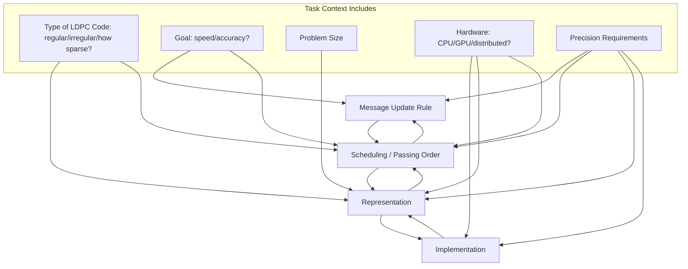

```mermaid
graph TD
    B[Message Update Rule]
    C[Scheduling / Passing Order]
    D[Representation]
    E[Implementation]

    B --> C
    C --> D
    D --> E

    E --> D
    D --> C
    C --> B

    subgraph ContextFactors["Task Context Includes"]
        A1[Type of LDPC Code: regular/irregular/how sparse?]
        A2[Goal: speed/accuracy?]
        A3[Problem Size]
        A4[Hardware: CPU/GPU/distributed?]
        A5[Precision Requirements]
    end

    A4 --> E
    A4 --> D
    A4 --> C

    A1 --> D
    A1 --> C
    A2 --> B
    A2 --> C
    A3 --> D

    A5 --> B
    A5 --> C
    A5 --> D
    A5 --> E

```